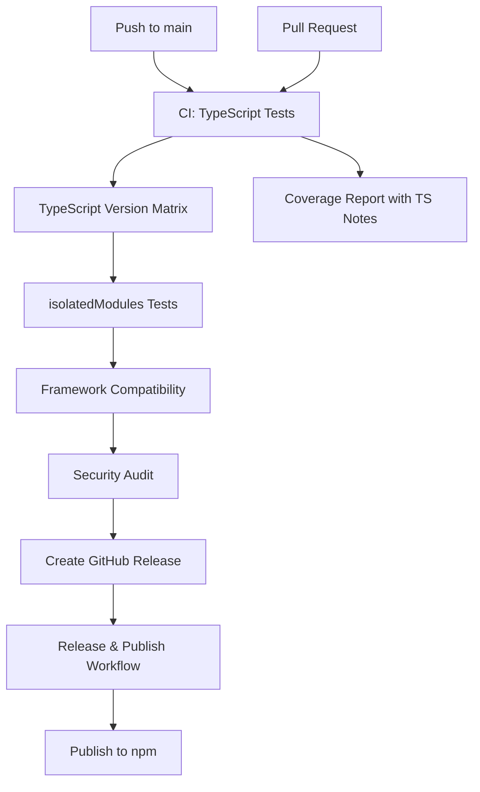

# GitHub Actions Workflows

This directory contains GitHub Actions workflows for automated CI/CD processes.

## 🚨 TypeScript Const Enum Package

**This package now uses TypeScript `const enum` for zero bundle size impact and compile-time inlining.**

⚠️ **Breaking Change**: This package is now TypeScript-only and requires proper TypeScript configuration.

## 🔄 Workflows

### 1. CI Workflow (`.github/workflows/ci.yml`)

**Triggers:** Pull requests and pushes to main/master branch

**What it does:**

- ✅ Tests the TypeScript const enum on Node.js 18, 20, and 21
- ✅ Validates TypeScript configuration and const enum compilation
- ✅ Verifies minimal JavaScript output (const enums are inlined)
- ✅ Tests TypeScript compatibility across versions (4.1, 4.9, 5.0, 5.4)
- ✅ Tests isolatedModules compatibility (Next.js 13+, Vite + SWC)
- ✅ Runs comprehensive test suite with coverage reporting
- ✅ Performs framework compatibility checks
- ✅ Runs security audits

**Jobs:**

- **test**: Multi-version Node.js testing and TypeScript validation
- **typescript-compatibility**: Tests across TypeScript versions 4.1 - 5.4
- **isolatedModules-test**: Validates const enum behavior with isolatedModules
- **compatibility**: Framework and package installation testing
- **security**: Security vulnerability scanning

### 2. Auto Version Bump (`.github/workflows/version-bump.yml`)

**Triggers:** Pushes to main/master branch (excludes documentation changes)

**What it does:**

- 🔍 Analyzes commit messages to determine version bump type
- 📝 Updates package.json version automatically
- 📋 Generates/updates CHANGELOG.md
- 🏷️ Creates git tags for releases
- 🚀 Creates GitHub releases

**Version Bump Rules:**

- **Major**: `[major]`, `[MAJOR]`, or `BREAKING CHANGE` in commit message
- **Minor**: `[minor]`, `[MINOR]`, `feat:`, or `feature:` in commit message
- **Patch**: `[patch]`, `[PATCH]`, `fix:`, `bug:`, or any other change

**Skip CI:**

- Add `[skip ci]` or `[ci skip]` to commit message to skip auto-versioning

### 3. Release & Publish (`.github/workflows/release.yml`)

**Triggers:** When a GitHub release is published

**What it does:**

- 🧪 Runs full TypeScript const enum test suite
- 🏗️ Builds and compresses the project (minimal JS output expected)
- 📦 Publishes to npm registry
- 📎 Uploads package as release asset
- 🎯 Creates deployment tracking

## 🔧 Setup Requirements

### Required Secrets

Add these secrets to your GitHub repository:

1. **`NPM_TOKEN`** - Your npm automation token
   - Go to [npm.com](https://www.npmjs.com/) → Account → Access Tokens
   - Create new token with "Automation" type
   - Add to GitHub repository secrets

### Repository Settings

1. **Branch Protection** (Recommended):

   - Require PR reviews before merging
   - Require status checks to pass (CI workflow)
   - Require up-to-date branches

2. **Actions Permissions**:
   - Allow GitHub Actions to create/approve pull requests
   - Allow GitHub Actions to write repository contents

## 📋 Usage Guide

### For Contributors

**Important**: This package is now TypeScript-only!

1. **TypeScript Required:**

   ```bash
   # Your project must use TypeScript
   npm install typescript --save-dev
   ```

2. **Configuration Required:**

   ```json
   // tsconfig.json
   {
     "compilerOptions": {
       "preserveConstEnums": true // Required for isolatedModules
     }
   }
   ```

3. **Regular Changes:**

   ```bash
   git commit -m "fix: resolve status code parsing issue"
   # This will trigger a PATCH version bump
   ```

4. **New Features:**

   ```bash
   git commit -m "feat: add new HTTP status codes"
   # This will trigger a MINOR version bump
   ```

5. **Breaking Changes:**

   ```bash
   git commit -m "BREAKING CHANGE: modify const enum structure"
   # This will trigger a MAJOR version bump
   ```

6. **Skip Auto-versioning:**
   ```bash
   git commit -m "docs: update README [skip ci]"
   # This will not trigger version bump
   ```

### For Maintainers

1. **Manual Release:**

   - Create a release manually on GitHub
   - Tag format: `v1.2.3`
   - This will trigger npm publishing

2. **Hotfix Release:**
   ```bash
   git commit -m "fix: critical const enum compilation issue [patch]"
   # Forces patch version bump
   ```

## 🚀 Workflow Sequence



## 📊 Status Badges

Add these badges to your README for a professional look:

### Essential Badges

```markdown
[](https://github.com/username/http-status-typed/actions/workflows/ci.yml)
[](https://github.com/username/http-status-typed/actions/workflows/release.yml)
[](https://www.npmjs.com/package/http-status-typed)
[](https://www.npmjs.com/package/http-status-typed)
[](https://codecov.io/gh/username/http-status-typed)
[](https://www.typescriptlang.org/)
```

### Technical Badges

```markdown
[](https://www.typescriptlang.org/)
[](package.json)
[](https://bundlephobia.com/result?p=http-status-typed)
[](package.json)
[](package.json)
[](tsconfig.json)
```

### Framework Compatibility

```markdown
[](https://nextjs.org/)
[](https://vitejs.dev/)
[](https://webpack.js.org/)
[](https://create-react-app.dev/)
```

**Note:** Replace `username` with your actual GitHub username.

### Badge Integration Features

The updated CI workflow now includes:

- **TypeScript Version Testing**: Compatibility across TypeScript 4.1 - 5.4
- **Const Enum Validation**: Ensures proper compilation and minimal output
- **isolatedModules Testing**: Validates Next.js 13+, Vite + SWC compatibility
- **Framework Testing**: Tests with various build tools and configurations
- **Coverage Reporting**: Automatic coverage reports with TypeScript notes
- **Security Auditing**: Regular vulnerability scanning

## 🔍 Monitoring

- **Build Status**: Check the Actions tab for workflow runs
- **npm Releases**: Monitor [npmjs.com/package/http-status-typed](https://www.npmjs.com/package/http-status-typed)
- **TypeScript Compatibility**: Review TypeScript version matrix results
- **Framework Compatibility**: Check isolatedModules and framework tests
- **Security**: Review security audit results in CI runs
- **Coverage**: View test coverage reports in CI artifacts

## 🐛 Troubleshooting

### Common Issues

1. **TypeScript Compilation Fails:**

   - Ensure TypeScript 4.1+ is installed
   - Check tsconfig.json configuration
   - Verify const enum syntax is correct

2. **isolatedModules Error:**

   - Add `"preserveConstEnums": true` to tsconfig.json
   - Required for Next.js 13+, Vite + SWC

3. **Bundle Size Unexpected:**

   - Const enums should produce minimal JavaScript
   - Check compilation output in CI logs
   - Verify no runtime enum object is created

4. **Import Errors:**
   - This package is TypeScript-only
   - Cannot be used in plain JavaScript projects
   - Requires proper TypeScript module resolution

### Framework-Specific Issues

1. **Next.js 13+:**

   ```json
   // tsconfig.json
   {
     "compilerOptions": {
       "isolatedModules": true,
       "preserveConstEnums": true
     }
   }
   ```

2. **Vite + SWC:**
   ```json
   // tsconfig.json
   {
     "compilerOptions": {
       "preserveConstEnums": true
     }
   }
   ```

### Manual Intervention

If workflows fail, you can:

1. Fix TypeScript configuration issues
2. Update const enum implementation if needed
3. Re-run failed workflows from the Actions tab
4. Check TypeScript version compatibility matrix
